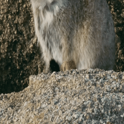
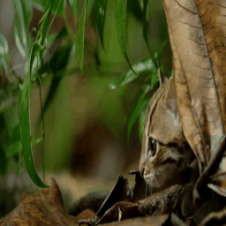
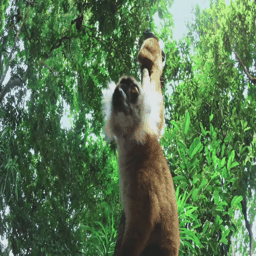

# video-sampler

<div align="center">

[](https://pypi.org/project/video-sampler/)
[](https://github.com/LemurPwned/video-sampler/pulls?utf8=%E2%9C%93&q=is%3Apr%20author%3Aapp%2Fdependabot)

[](https://github.com/psf/black)
[](https://github.com/LemurPwned/video-sampler/blob/main/.pre-commit-config.yaml)

[](https://github.com/LemurPwned/video-sampler/blob/main/LICENSE)
[](https://img.shields.io/pypi/dm/video-sampler.svg)

Video sampler allows you to efficiently sample video frames and summarize the videos.
Currently, it uses keyframe decoding, frame interval gating and perceptual hashing to reduce duplicated samples.

**Use case:** video data collection for machine learning, video summarisation, video frame analysis.

</div>

## Table of Contents

- [video-sampler](#video-sampler)
  - [Table of Contents](#table-of-contents)
  - [Documentation](#documentation)
  - [Features](#features)
  - [Installation and Usage](#installation-and-usage)
    - [Basic usage](#basic-usage)
      - [YT-DLP integration plugin](#yt-dlp-integration-plugin)
        - [Extra YT-DLP options](#extra-yt-dlp-options)
      - [OpenAI summary](#openai-summary)
      - [API examples](#api-examples)
    - [Advanced usage](#advanced-usage)
      - [Gating](#gating)
      - [CLIP-based gating comparison](#clip-based-gating-comparison)
      - [Blur gating](#blur-gating)
  - [Benchmarks](#benchmarks)
  - [Benchmark videos](#benchmark-videos)
  - [Flit commands](#flit-commands)
    - [Build](#build)
    - [Install](#install)
    - [Publish](#publish)
  - [🛡 License](#-license)
  - [📃 Citation](#-citation)

## Documentation

Documentation is available at [https://lemurpwned.github.io/video-sampler/](https://lemurpwned.github.io/video-sampler/).

## Features

- [x] Direct sampling methods:
  - [x] `hash` - uses perceptual hashing to reduce duplicated samples
  - [x] `entropy` - uses entropy to reduce duplicated samples (work in progress)
  - [x] `gzip` - uses gzip compressed size to reduce duplicated samples (work in progress)
  - [x] `buffer` - uses sliding buffer to reduce duplicated samples
  - [x] `grid` - uses grid sampling to reduce duplicated samples
- [x] Gating methods (modifications on top of direct sampling methods):
  - [x] `clip` - uses CLIP to filter out frames that do not contain the specified objects
  - [x] `blur` - uses blur detection to filter out frames that are too blurry
- [x] Language capture:
  - [x] Keyword capture from subtitles
- [x] Integrations
  - [x] YTDLP integration -- streams directly from [yt-dlp](http://github.com//yt-dlp/yt-dlp) queries,
        playlists or single videos
  - [x] OpenAI multimodal models integration for video summaries

## Installation and Usage

If you intend to use all the integrations, you need all the dependencies:

```bash
python3 -m pip install -U video_sampler[all]
```

for minimalist no-cli usage install:

```bash
python3 -m pip install -U video_sampler
```

Available extras are:

- `yt-dlp` - for YT-DLP integration
- `clip` - for CLIP models integration
- `language` - for language capture
- `all` - for all dependencies
- `dev` - for development dependencies

To see all available options, run:

```bash
python3 -m video_sampler --help
```

### Basic usage

Plain:

```bash
python3 -m video_sampler hash FatCat.mp4 ./dataset-frames/ --hash-size 3 --buffer-size 20
```

From the config file:

```bash
python3 -m video_sampler config ./configs/hash_base.yaml /my-video-folder/ ./my-output-folder
```

You can set the number of workers to use with the `n_workers` parameter. The default is 1.

#### YT-DLP integration plugin

Before using please consult the ToS of the website you are scraping from -- use responsibly and for research purposes.
To use the YT-DLP integration, you need to install `yt-dlp` first (see [yt-dlp](http://github.com//yt-dlp/yt-dlp)).
Then, you simply add `--yt-dlp` to the command, and it changes the meaning of the `video_path` argument.

- to search

```bash
video_sampler hash "ytsearch:cute cats" ./folder-frames/ \
  --hash-size 3 --buffer-size 20 --ytdlp
```

- to sample a single video

```bash
video_sampler hash "https://www.youtube.com/watch?v=W86cTIoMv2U" ./folder-frames/ \
    --hash-size 3 --buffer-size 20 --ytdlp
```

- to sample a playlist

```bash
video_sampler hash "https://www.youtube.com/watch?v=GbpP3Sxp-1U&list=PLFezMcAw96RGvTTTbdKrqew9seO2ZGRmk" ./folder-frames/ \
  --hash-size 3 --buffer-size 20 --ytdlp
```

- segment based on the keyword extraction

```bash
video_sampler hash "https://www.youtube.com/watch?v=GbpP3Sxp-1U&list=PLFezMcAw96RGvTTTbdKrqew9seO2ZGRmk" ./folder-frames/ \
  --hash-size 3 --buffer-size 20 --ytdlp --keywords "cat,dog,another keyword,test keyword"
```

The videos are never directly downloaded, only streamed, so you can use it to sample videos from the internet without downloading them first.

##### Extra YT-DLP options

You can pass extra options to yt-dlp by using the `-yt-extra-args` flag. For example:

this will only sample videos uploaded before 2019-01-01:

```bash
... --ytdlp --yt-extra-args '--datebefore 20190101'
```

or this will only sample videos uploaded after 2019-01-01:

```bash
... --ytdlp --yt-extra-args '--dateafter 20190101'
```

or this will skip all shorts:

```bash
... --ytdlp --yt-extra-args '--match-filter "original_url!*=/shorts/ & url!*=/shorts/"
```

#### OpenAI summary

To use the OpenAI multimodal models integration, you need to install `openai` first `pip install openai`.
Then, you simply add `--summary-interval` to the command and the url.

In the example, I'm using [llamafile](https://github.com/Mozilla-Ocho/llamafile) LLAVA model to summarize the video every 50 frames. If you want to use the OpenAI multimodal models, you need to export `OPENAI_API_KEY=your_api_key` first. The format should also work with default OpenAI stuff.

To replicate, run LLAVA model locally and set the `summary-url` to the address of the model. Specify the `summary-interval` to the minimal interval in seconds between frames that are to be summarised/described.

```bash
video_sampler hash ./videos/FatCat.mp4 ./output-frames/ --hash-size 3 --buffer-size 20 --summary-url "http://localhost:8080/completion" --summary-interval 50
```

Supported env in case you need those:

- `OPENAI_API_KEY` - OpenAI API key
- `OPENAI_MODEL` - OpenAI model name

Confirmed that you can make it work with e.g. LM Studio, but you need to adjust the `summary-url` to the correct address, e.g. it might be `"http://localhost:8080/completions"`. Similar if you want to use the OpenAI API.

Some frames, based on the interval specified, will be summarised by the model and the result will saved in the `./output-frames/summaries.json` folder. The frames that are summarised come after the sampling and gating process happens, and only those frames that pass both stages are viable for summarisation.

```jsonl
summaries.jsonl
---
{"time": 56.087, "summary": "A cat is walking through a field of tall grass, with its head down and ears back. The cat appears to be looking for something in the grass, possibly a mouse or another small creature. The field is covered in snow, adding a wintry atmosphere to the scene."}
{"time": 110.087, "summary": "A dog is walking in the snow, with its head down, possibly sniffing the ground. The dog is the main focus of the image, and it appears to be a small animal. The snowy landscape is visible in the background, creating a serene and cold atmosphere."}
{"time": 171.127, "summary": "The image features a group of animals, including a dog and a cat, standing on a beach near the ocean. The dog is positioned closer to the left side of the image, while the cat is located more towards the center. The scene is set against a beautiful backdrop of a blue sky and a vibrant green ocean. The animals appear to be enjoying their time on the beach, possibly taking a break from their daily activities."}
```

#### API examples

See examples in [./scripts](./scripts/run_benchmarks.py).

### Advanced usage

There are 3 sampling methods available:

- `hash` - uses perceptual hashing to reduce duplicated samples
- `entropy` - uses entropy to reduce duplicated samples (work in progress)
- `gzip` - uses gzip compressed size to reduce duplicated samples (work in progress)

To launch any of them you can run and substitute `method-name` with one of the above:

```bash
video_sampler buffer `method-name` ...other options
```

e.g.

```bash
video_sampler buffer entropy --buffer-size 20 ...
```

where `buffer-size` for `entropy` and `gzip` mean the top-k sliding buffer size. Sliding buffer also uses hashing to reduce duplicated samples.

#### Gating

Aside from basic sampling rules, you can also apply gating rules to the sampled frames, further reducing the number of frames.
There are 3 gating methods available:

- `pass` - pass all frames
- `clip` - use CLIP to filter out frames that do not contain the specified objects
- `blur` - use blur detection to filter out frames that are too blurry

Here's a quick example of how to use clip:

```bash
python3 -m video_sampler clip ./videos ./scratch/clip --pos-samples "a cat" --neg-samples "empty background, a lemur"  --hash-size 4
```

#### CLIP-based gating comparison

Here's a brief comparison of the frames sampled with and without CLIP-based gating with the following config:

```python
  gate_def = dict(
      type="clip",
      pos_samples=["a cat"],
      neg_samples=[
          "an empty background",
          "text on screen",
          "a forest with no animals",
      ],
      model_name="ViT-B-32",
      batch_size=32,
      pos_margin=0.2,
      neg_margin=0.3,
  )
```

Evidently, CLIP-based gating is able to filter out frames that do not contain a cat and in consequence, reduce the number of frames with plain background. It also thinks that a lemur is a cat, which is not entirely wrong as fluffy creatures go.

|                      Pass gate (no gating)                      |                            CLIP gate                            |                              Grid                               |
| :-------------------------------------------------------------: | :-------------------------------------------------------------: | :-------------------------------------------------------------: |
|      |      |      |
|     |     |     |
|  |  |  |

The effects of gating in numbers, for this particular set of examples (see `produced` vs `gated` columns). `produced` represents the number of frames sampled without gating, here after the perceptual hashing, while `gated` represents the number of frames sampled after gating.

| video          | buffer | gate | decoded | produced | gated |
| -------------- | ------ | ---- | ------- | -------- | ----- |
| FatCat.mp4     | grid   | pass | 179     | 31       | 31    |
| SmolCat.mp4    | grid   | pass | 118     | 24       | 24    |
| HighLemurs.mp4 | grid   | pass | 161     | 35       | 35    |
| FatCat.mp4     | hash   | pass | 179     | 101      | 101   |
| SmolCat.mp4    | hash   | pass | 118     | 61       | 61    |
| HighLemurs.mp4 | hash   | pass | 161     | 126      | 126   |
| FatCat.mp4     | hash   | clip | 179     | 101      | 73    |
| SmolCat.mp4    | hash   | clip | 118     | 61       | 31    |
| HighLemurs.mp4 | hash   | clip | 161     | 126      | 66    |

#### Blur gating

Helps a little with blurry videos. Adjust threshold and method (`laplacian` or `fft`) for best results.
Some results from `fft` at `threshold=20`:

| video      | buffer | gate | decoded | produced | gated |
| ---------- | ------ | ---- | ------- | -------- | ----- |
| MadLad.mp4 | grid   | pass | 120     | 31       | 31    |
| MadLad.mp4 | hash   | pass | 120     | 110      | 110   |
| MadLad.mp4 | hash   | blur | 120     | 110      | 85    |

## Benchmarks

Configuration for this benchmark:

```bash
SamplerConfig(min_frame_interval_sec=1.0, keyframes_only=True, buffer_size=30, hash_size=X, queue_wait=0.1, debug=True)
```

|                                 Video                                 | Total frames | Hash size | Decoded | Saved |
| :-------------------------------------------------------------------: | :----------: | :-------: | :-----: | :---: |
|        [SmolCat](https://www.youtube.com/watch?v=W86cTIoMv2U)         |     2936     |     8     |   118   |  106  |
|        [SmolCat](https://www.youtube.com/watch?v=W86cTIoMv2U)         |      -       |     4     |    -    |  61   |
| [Fat Cat](https://www.youtube.com/watch?v=kgrV3_g9rYY&ab_channel=BBC) |     4462     |     8     |   179   |  163  |
| [Fat Cat](https://www.youtube.com/watch?v=kgrV3_g9rYY&ab_channel=BBC) |      -       |     4     |    -    |  101  |
|       [HighLemurs](https://www.youtube.com/watch?v=yYXoCHLqr4o)       |     4020     |     8     |   161   |  154  |
|       [HighLemurs](https://www.youtube.com/watch?v=yYXoCHLqr4o)       |      -       |     4     |    -    |  126  |

---

```bash
SamplerConfig(
    min_frame_interval_sec=1.0,
    keyframes_only=True,
    queue_wait=0.1,
    debug=False,
    print_stats=True,
    buffer_config={'type': 'entropy'/'gzip', 'size': 30, 'debug': False, 'hash_size': 8, 'expiry': 50}
)
```

|                                 Video                                 | Total frames |  Type   | Decoded | Saved |
| :-------------------------------------------------------------------: | :----------: | :-----: | :-----: | :---: |
|        [SmolCat](https://www.youtube.com/watch?v=W86cTIoMv2U)         |     2936     | entropy |   118   |  39   |
|        [SmolCat](https://www.youtube.com/watch?v=W86cTIoMv2U)         |      -       |  gzip   |    -    |  39   |
| [Fat Cat](https://www.youtube.com/watch?v=kgrV3_g9rYY&ab_channel=BBC) |     4462     | entropy |   179   |  64   |
| [Fat Cat](https://www.youtube.com/watch?v=kgrV3_g9rYY&ab_channel=BBC) |      -       |  gzip   |    -    |  73   |
|       [HighLemurs](https://www.youtube.com/watch?v=yYXoCHLqr4o)       |     4020     | entropy |   161   |  59   |
|       [HighLemurs](https://www.youtube.com/watch?v=yYXoCHLqr4o)       |      -       |  gzip   |    -    |  63   |

## Benchmark videos

- [SmolCat](https://www.youtube.com/watch?v=W86cTIoMv2U)
- [Fat Cat](https://www.youtube.com/watch?v=kgrV3_g9rYY&ab_channel=BBC)
- [HighLemurs](https://www.youtube.com/watch?v=yYXoCHLqr4o)
- [MadLad](https://www.youtube.com/watch?v=MWyBgudQqsI)

## Flit commands

#### Build

```
flit build
```

#### Install

```
flit install
```

#### Publish

Remember to bump the version in `pyproject.toml` before publishing.

```
flit publish
```

## 🛡 License

[](https://github.com/LemurPwned/video-sampler/blob/main/LICENSE)

This project is licensed under the terms of the `MIT` license. See [LICENSE](https://github.com/LemurPwned/video-sampler/blob/main/LICENSE) for more details.

## 📃 Citation

```bibtex
@misc{video-sampler,
  author = {video-sampler},
  title = {Video sampler allows you to efficiently sample video frames},
  year = {2023},
  publisher = {GitHub},
  journal = {GitHub repository},
  howpublished = {\url{https://github.com/LemurPwned/video-sampler}}
}
```
